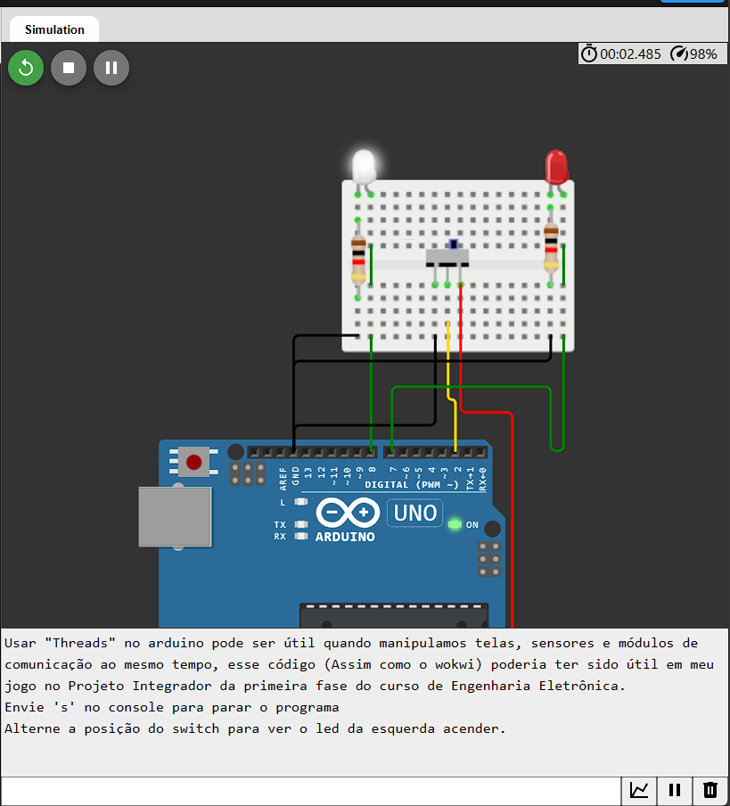

# Threads 
O Arduino não oferece suporte a tarefas paralelas isoladas (Threads), mas podemos fazer com que o loop principal alterne a execução da função condicionalmente e, assim, simule o threading com o mecanismo Protothread.  
Existem diversas implementações de threads para o Arduino, a escolhida para este projeto foi o [ArduinoThread](https://github.com/ivanseidel/ArduinoThread).  

# Utilidade  
Usar "Threads" no arduino pode ser útil quando manipulamos telas, sensores e módulos de comunicação ao mesmo tempo, esse código poderia ter sido útil em meu jogo no [Projeto Integrador da primeira fase do curso de Engenharia Eletrônica.](https://github.com/dgrfps/projeto-integrador)  

# Woki  
Esse projeto pode ser encontrado em:   
https://wokwi.com/projects/392252268512443393

